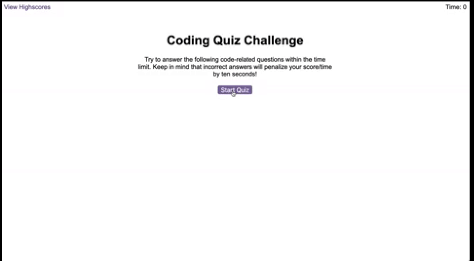

For the fourth assignment in class, we had to create a quiz, with a theme of our choice.   The quiz had to move through questions, and the score would be the remainder of time left on the countdown clock.   Wrong answers had to decrement the timer by 10 seconds.   For a bonus we could have a high scores page that would allow the user to enter intials into a high scores board.  THis was the target site we were given at the beginning of class.
  We were given no intial code or direction, just an idea of where to end up.

I had receieved intial information for the coming week.  I had read ahead on jQuery and mistaken assumed that this project was to be written in jQuery.  I started by creating an html, css, and javascript page.  I linked both bootstrap and jquery.  I then created the index, using a pretty basic layout.   I separated the answers into an unordered list with the question in a header above.  I initally created the buttons using bootstrap.  Unfortunately I found it to be too limiting when it came to styling.   I then created buttons on my own and styled appropriately.   I did some very basic styling inside css to get an idea of the page layout.  It was just easier to di it this way to see where everything was inside the page.
I continued by writing some pseudocode and then attempting to write a skeletal write up in my code on the page.   There were not a lot of resources available on the web for jQuery.  I reached out to a tutor for some of the page set up.   I went back and forth on how to create the different questions.   I intially thought that setting up individual classes for correct and incorrect would help, however with the answer moving places that seemed impossible.   I worked on some styling to attempt to take a break from the harder questions.
I finally landed on making each question and answer set a function that you could cycle through.   I could't find helpful information on arrays with functions via jQuery.  
Because most of the answers were incorrect (3 out of 4), I figured I could possibly have incorrect be the default and cycle through the correct answers using a correct class on those questions.  
I moved on to the timer function.  I set up the start button and hid all other items from the page until the start button was clicked.   From there the timer started counting down.  My page was working, but the code felt a little bulky.   This is when I made my fatal flaw.   I decided to rewrite the entire page.  I was becoming increasingly frustrated with jQuery.   I was unfamiliar with it and it was roadblock after roadblock to make things work.   I spent around 6 hours trying to rewrite the code.  I was attempting to set up arrays via JavaScript.   This was truly an enormous error on my part.  I didn't commit a lot of the code because I was hoping to get a working page going before I did.  This was honestly a wrong turn.  
Initially I attempted to put the high score card on my original page.   I was hiding it until the quiz was finished.   This is where I made my second big mistake.  I attempted to make a separate page.  I just think the undertaking of it was too much.
I struggled with the local storage.   For whatever reason I could not get my score to save to the local storage space.   I spent a good amount of time attempting it before I had to abandon ship.
These are the two finalized pages.  I did a link to send someone over to the original page to play the quiz again.  
I felt completley out of my element in trying to make this page happen.   The jQuery, without enough knowledge, felt limiting and overwhelming.   Most resources online were for Javascript only which meant in a lot of ways I was left to muddle through it on my own.  This was definetly the most challanging project to date.  
Here are the final photos:

Here is a link to my deployed page:
https://ckhilpisch.github.io/CodingQuiz_4/.